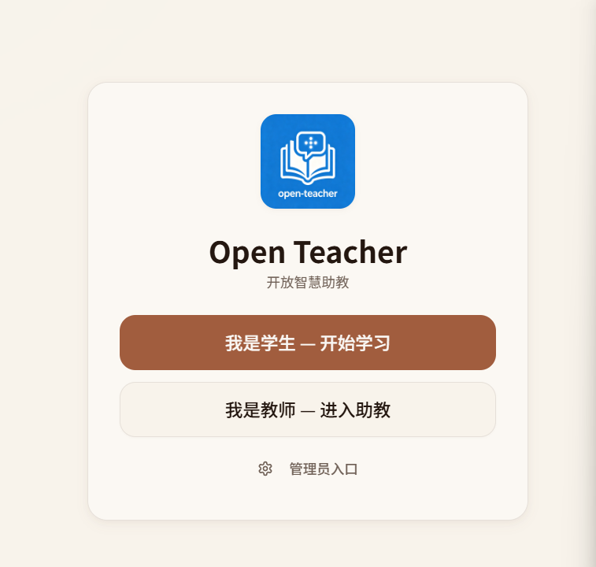

# OpenTeacher - 开放智慧助教



基于国产大模型的智能教学助手系统

[](https://opensource.org/licenses/MIT)
[](https://github.com/yang8362921/open-teacher/stargazers)

## 项目简介

OpenTeacher 是一个基于教师个人知识库的智能语音交互教学机器人，支持数字教学（语音问答）、语音识别、语音合成、知识库管理、智能对话、真人照片数字人、教师引导式设置向导、智能助教开场白和学生记忆系统。

## 项目特色

- 🤖 **AI智能对话** - 支持火山引擎、OpenAI 等多种大模型
- 🎭 **数字人形象** - 支持真人照片数字人展示
- 🎯 **学生记忆系统** - 自动追踪学习进度和知识掌握情况
- 📚 **知识库管理** - 教师专属知识库，支持文本、文件、URL导入
- 🔊 **语音交互** - 完整的ASR/TTS系统，支持语音问答
- 🔧 **完全独立部署** - 不依赖第三方平台，支持本地部署
- 🖼️ **图像生成** - 支持课程相关图像生成

## 快速开始

### 环境要求

- Node.js 18+
- pnpm 9+

### 安装和启动

```bash
# 克隆项目
git clone https://github.com/yang8362921/open-teacher.git
cd open-teacher

# 安装依赖
pnpm install

# 配置环境变量
copy .env.example .env
# 编辑 .env 文件，填入你的配置

# 启动开发服务器
pnpm dev
```

访问 http://localhost:5000 即可使用！

## 文档

- [📖 开发手册](docs/开放智慧助教（open%20teacher）开发手册.pdf)
- [📘 使用手册](docs/开放智慧助教（open%20teacher）使用手册.pdf)
- [项目结构说明](docs/项目结构说明.md)

## 功能介绍

### 1. 智能对话系统
- 基于教师知识库的智能问答
- 支持流式输出
- 口语化回答，适合语音播报

### 2. 数字教学模式（语音问答）
- 基于Web Audio API的持续监听和实时音频分析
- 回声防护策略：TTS播放期间自动静音麦克风
- VAD语音检测：智能识别语音开始和结束
- 手动打断功能：随时停止TTS播放
- TTS预解码技术：消除语音段间延迟

### 3. 学生记忆系统
- 自动追踪学生知识掌握情况
- 三档分类（已掌握/学习中/薄弱）
- 个性化教学路径推荐
- 教学策略记忆与优化

### 4. 知识库管理
- 支持文本输入、文件上传、URL导入
- 语义搜索功能
- 教师知识库隔离
- 知识库批量导入

### 5. 配置管理
- 可视化配置界面
- 支持多种AI模型切换
- 完整的API配置管理
- 实时配置生效

## 技术栈

| 技术 | 版本 | 说明 |
|------|------|------|
| Next.js | 16+ | 前端框架 |
| React | 19 | UI库 |
| TypeScript | 5.7+ | 类型系统 |
| Tailwind CSS | 4.0 | 样式系统 |
| shadcn/ui | 最新 | UI组件库 |
| Supabase | 2.47+ | 数据库 |
| OpenAI SDK | 6.34+ | AI集成 |
| 火山引擎API | 最新 | 国产AI支持 |
| 云存储 | - | 对象存储支持 |

## 项目结构

```
open-teacher/
├── src/
│   ├── app/                          # Next.js App Router
│   │   ├── api/                     # API路由
│   │   │   ├── admin/               # 管理员API
│   │   │   ├── audio/               # 音频相关API
│   │   │   ├── chat/                # 对话API
│   │   │   ├── image/               # 图像生成API
│   │   │   ├── knowledge/           # 知识库API
│   │   │   ├── memory/              # 记忆系统API
│   │   │   ├── setup/               # 设置API
│   │   │   └── teacher/             # 教师API
│   │   ├── layout.tsx               # 根布局
│   │   ├── page.tsx                 # 主页面
│   │   └── globals.css              # 全局样式
│   ├── components/                  # React组件
│   │   ├── ui/                      # shadcn/ui组件
│   │   ├── LoginOverlay.tsx         # 登录界面
│   │   ├── DigitalHuman.tsx         # 数字人组件
│   │   ├── KnowledgeManager.tsx     # 知识库管理
│   │   ├── TeacherDashboard.tsx     # 教师面板
│   │   ├── AdminDashboard.tsx       # 管理后台
│   │   └── ...其他组件
│   ├── services/                    # 服务层
│   │   ├── voice/                   # 语音服务
│   │   ├── storage/                 # 存储服务
│   │   ├── knowledge/               # 知识库服务
│   │   └── llm/                     # LLM服务
│   ├── lib/                         # 工具库
│   ├── hooks/                       # React Hooks
│   └── storage/database/            # 数据库相关
├── public/                          # 静态资源
├── docs/                            # 文档
│   ├── 开放智慧助教（open teacher）开发手册.pdf
│   └── 开放智慧助教（open teacher）使用手册.pdf
├── scripts/                         # 辅助脚本
├── .env.example                     # 环境变量示例
├── package.json                     # 项目配置
└── README.md                        # 项目说明
```

## 配置说明

详细配置请参考 [开发手册](docs/开放智慧助教（open%20teacher）开发手册.pdf)

### 环境变量

```env
# 基础配置
PORT=5000
HOSTNAME=localhost
COZE_PROJECT_ENV=DEV

# LLM服务提供商（可选：openai 或 volcengine）
LLM_PROVIDER=volcengine

# 火山引擎配置
VOLCENGINE_API_KEY=your_volcengine_api_key
VOLCENGINE_SERVICE_ID=your_service_id
VOLCENGINE_MODEL=your_model_name

# OpenAI配置
OPENAI_API_KEY=your_openai_api_key
OPENAI_MODEL=gpt-4o
OPENAI_BASE_URL=https://api.openai.com/v1

# Supabase配置
COZE_SUPABASE_URL=https://your-project.supabase.co
COZE_SUPABASE_ANON_KEY=your_anon_key
COZE_SUPABASE_SERVICE_ROLE_KEY=your_service_role_key

# 对象存储配置（可选）
STORAGE_ENDPOINT=https://your-storage-endpoint
STORAGE_ACCESS_KEY=your_access_key
STORAGE_SECRET_KEY=your_secret_key
STORAGE_BUCKET_NAME=your_bucket_name
```

## 部署说明

### 本地开发部署

1. 克隆项目
2. 配置环境变量（.env）
3. 安装依赖：`pnpm install`
4. 启动开发服务器：`pnpm dev`
5. 访问 http://localhost:5000

### 生产环境部署

1. 构建项目：`pnpm build`
2. 启动生产服务器：`pnpm start`

### 数据库初始化

使用项目中的 Supabase 配置和 `init-database.ts` 脚本初始化数据库。

## 开源协议

MIT License - 详见 [LICENSE](LICENSE)

## 贡献

欢迎提交 Issue 和 Pull Request！

---

Made with ❤️ by OpenTeacher Team